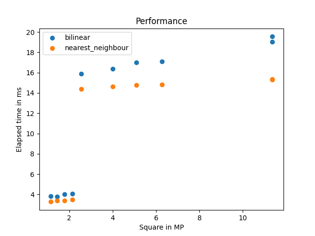

# HFT

3-е ДЗ по курсу CV

## Результаты работы

### Повернутые изображения

В папке [results](https://github.com/IlyaUsmanov/ABBYY_CV22/tree/main/hw3/results)

### Время работы

### Оценка производительности

Все операции помимо HFT работают за $O(N^2)$ по времени и памяти. Сам же HFT по времени работает за $O(N^2 \log N)$, что следует из рекурренты $T(h) = w * h + 2 * T(h / 2)$, по памяти же $O(N^2)$, т.к. в любой момент времени хранятся массивы только в одной рекурсивной ветке, а их размеры образуют убывающую геометрическую прогрессию $( w * h, w * h / 2, w * h / 4... ) $

### Оптимизации

В чистом виде идея, изложенная на лекции, у меня не заработала. Я смог выявить 2 причины: первая состояла в том, что фон документа сильно влиял на дисперсию, поэтому алгоритм я применяю ни к изображению в чистом виде, а к вырезанной из него середине; а вторая - неожиданные всплески дисперсии при больших по модулю углах, поэтому я сделал то же предположение, что и в оригинальной статье(поставил границы возможных углов, так, чтобы они были не слишком большими). Так что из возможных оптимизаций первоочередными мне кажутся более элегантные способы решения этих проблем.